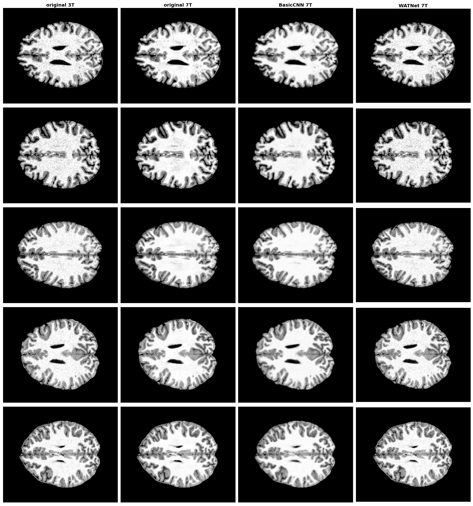

# Synthesizing 7T MRI from 3T MRI images via deep neural in spatial and wavelet domains

### Introduction 
Magnetic Resonance Imaging (MRI) has been widely used in the medical field for the last decades. The resolution of MRI images has increased a lot since its creation, moving from 0.5T for the first MRI in the 1980s, to 7T MRI. However, such precision comes with a cost. Scanners that are able to create direct 7T MRI from a patient’s observation are very costly and quite few worldwide. Previous work has proven its efficiency in this field, using different learning-based methods, but their performance is highly influenced by the quality of the hand-crafted features.

### Main method

In their paper [Synthesizing 7T MRI from 3T MRI via deep neural in spatial and wavelet domains. 2020](https://www.sciencedirect.com/science/article/abs/pii/S1361841520300293), Qu et al. introduced a deep learning network *WATNet (Wavelet-based Affine Transformation Network)* that leverages both the spatial and frequency content of images using wavelets to learn the low-frequency information (i.e. contrast) while preserving the high-frequency details. 

### Purpose of the project
In this project, we aim at reproducing the method and results of the paper and comparing the performance of the WATNet to that of a basic CNN architecture composed of Conv2D + BatchNorm + ReLU/sigmoid blocks.

### Code
The code is organised as follows: 
* `raw_folder`: comprises the raw 7T MRI images of 10 different subjects.
* `final_data`: 3T and 7T images after pre-processing the 7T MRI and artificially creating the 3T MRI from 7T through addition of Gaussian noise.
* `notebooks`: folder that contains: 
  * `data_preprocessing.ipynb`: notebook describing the pre-processing steps of the 3T and 7T images.

  * `BasicCNN.ipynb`: notebook describing the basic CNN network architecture and implementation.

  * `WATNet.ipynb`: notebook describing the WATNet network architecture and implementation.
* `original_paper.pdf`: the original paper by Qu et al. 

* `MLSP_report.pdf`: report describing the work performed in this project.
* `MLSP_slides.pdf`: slides of the presentation.

### Some results 

Figure 1: Comparison of the 100th slice of 5 synthesized 7T images using BasicCNN and WATNet.

Figure 2: Comparison of 2 patches from the synthesized 7T MRI images.

